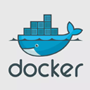

# wordpress-dev kit (docker, webpack, babel, ...)





> I always found it frustrating to be thrown back to the frontend stone-ages when it came to wordpress theme development. Especially local development was tedious and annoying, so I built a stack I am more comfortable with and hope that it might be helpful to other frontend devs out there.

## Main Features

- docker-compose
- webpack4
- hot module reloading
- es6+ with babel and runtime
- eslint (recommended)
- scss, postcss, autoprefixer
- stylelint (recommended)

## Prerequesites
> you'll need to know a bit about webpack, npm and the modern frontend environment. you'll also need to have docker installed on your machine as we'll be using docker-compose to run our local development server.

## Use

### local development with docker-compose
run `docker-compose up -d`. this will cook up a new docker container, fetch and install wordpress and map the contents of `./starter-theme` inside the container. once its done you can browse http://localhost to view your local wordpress installation.

> note that especially on the first run, it will take a bit until you can access http://localhost as docker needs to download everything, setup your mysql server and so on. so be patient.

### theme development
Step into the theme directory with `cd starter-theme` and run `npm install`.
all the source files for scss and js are found in `./starter-theme/src/` and will be compiled to `./starter-theme/dist/` on production.

I've split the scripts in `admin.js` and `site.js` as we might want to have scripts specifically loaded only on the admin page, and others only on the frontend.

#### development

to work on your theme, go to `./starter-theme/functions.php` and search for `function starter_theme_scripts()`. Inside there ensure you load the script you want to work on / test with `wp_enqueue_script('starter-theme-scripts-dev', 'http://localhost:8080/site.js');`. In development, we dont need to reference the css styles, as we inject it into our site through javascript (is faster and totally ok for development).

Run `npm start` to start webpack-dev-server and serve your files from memory on http://localhost:8080

since we're using HMR and webpack-dev-server, we dont need to reload our page after changes to scss or js. webpack will decide itself when to reload.

#### production

to build your theme, run `npm run build`. This compiles your scss and js and writes it to your `./starter-theme/dist/` folder.

for production, open `./starter-theme/functions.php` and search for `function starter_theme_scripts()`.
now comment out the development script reference from above, and make sure you load all your compiled files:

```php
wp_enqueue_style('starter-theme-style', get_template_directory_uri() . '/dist/site.css');
wp_enqueue_script('starter-theme-scripts', get_template_directory_uri() . '/dist/site.js');
wp_enqueue_script('starter-theme-admin-scripts', get_template_directory_uri() . '/dist/admin.js');
```

## Contribute (pull requests welcome)
I dont want this package to be too opinionated when it comes to styling basics or functionality. It should merely be a starting ground, and feature things we pretty much always need when building new themes.

- automate static reference changes with npm scripts (no manual reference change in function.php)

## Credit

* theme base: [https://github.com/Automattic/_s](https://github.com/Automattic/_s)
* docker-compose: [https://github.com/nezhar/wordpress-docker-compose]
